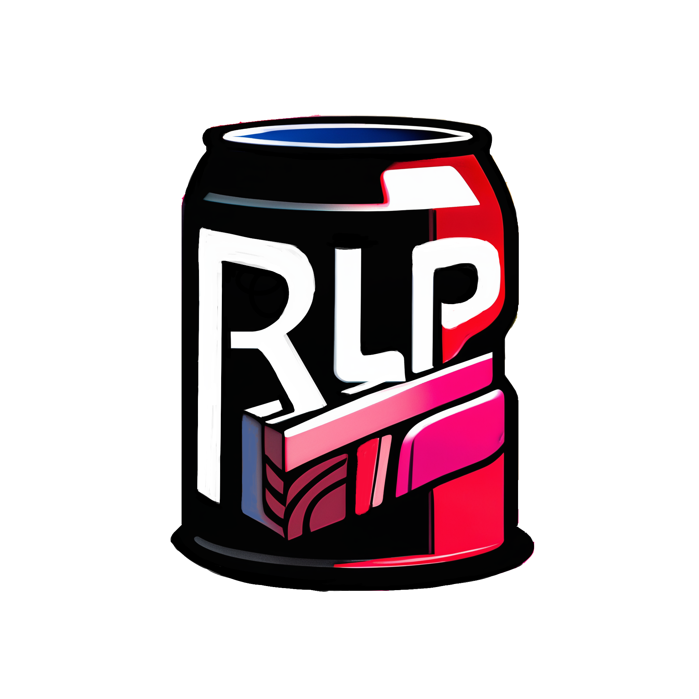

# <div align="center">Relurpify</div>

<div align="center">
  
</div>

<div align="center">
  Local-first agentic software work with a security-first runtime.
</div>

## What Is Relurpify?

To the day it rewrites itself 

Relurpify is a fullstack Agent framework 
- generic execution Agent library 
- LLM oriented memory/context/graph/sandbox management framework 
- (Rex) event agent, distributed coordination fabric , protocol platform 
- archaeology provenance memory system 
- extensive testsuite
- (Euclo) coding agent 
- TUI interfaces 


## Currently Available

### Relurpish Agent TUI

- Default Agent TUI 
- Euclo coding agent access 

## Requirements

- Go `1.25+`
- Docker or another supported container runtime
- gVisor `runsc`
- Ollama

In sandboxed environments you may also want repo-local Go caches:

```bash
export GOMODCACHE=$PWD/.gomodcache
export GOCACHE=$PWD/.gocache
```

## Install

### Build from source

```bash
go build ./app/relurpish
```

### Optional: build all project binaries

```bash
go build ./...
```

## Setup

Run the doctor command before starting Relurpify:

```bash
go run ./app/relurpish doctor
```

`doctor` checks the local environment, verifies required dependencies, and initializes `relurpify_cfg/` for the current workspace when needed.

## Run Euclo in Relurpish

Start the terminal app with:

```bash
go run ./app/relurpish chat
```

This launches `relurpish` and starts the default Euclo coding workflow in the current workspace.

For a typical first-use flow:

```bash
go build ./app/relurpish
go run ./app/relurpish doctor
go run ./app/relurpish chat
```

## Future Features

The repository already contains broader platform work that is planned for later release maturity, including:

- `nexus`, the distributed coordination layer
- `nexusish`, the administration interface for Nexus
- `Rex`, the distributed runtime / agent path

## Additional Tools

Relurpify also includes developer tooling for internal workflows and testing:

```bash
# List discovered agents
go run ./app/dev-agent-cli agents list

# Run agent tests
go run ./app/dev-agent-cli agenttest run

# Scaffold a skill
go run ./app/dev-agent-cli skill init my-skill --description "My focused workflow" --with-tests

# Validate a skill
go run ./app/dev-agent-cli skill validate my-skill
```

## Documentation

Project documentation lives under `docs/`.
