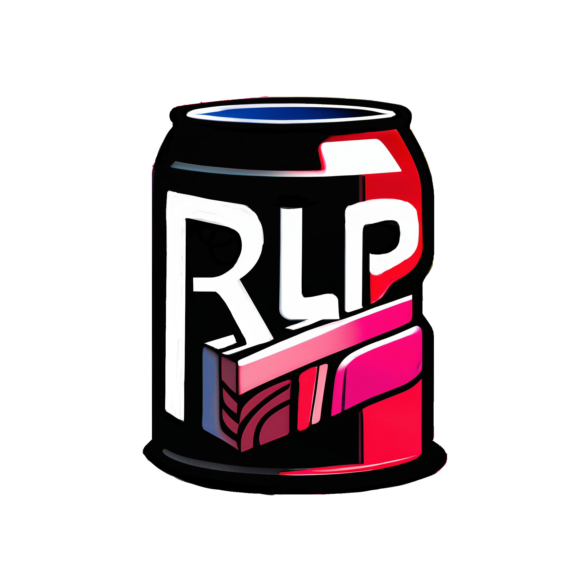

# <div align="center">Relurpify</div>

<div align="center">
  
</div>

<div align="center">
  To the day it rewrites itself
</div>

## What Is Relurpify?

Relurpify is a fullstack Agent framework 
- generic execution Agent library 
- LLM oriented memory/context/graph/sandbox management framework 
- archaeology memory system 
- extensive testsuite
- (Euclo) coding agent 
- TUI interfaces 

## Currently Available

### Relurpish Agent TUI

- Default Agent TUI 
- Euclo coding agent access 

## Requirements

- Go `1.25+`
- Docker or another supported container runtime
- gVisor `runsc`
- Ollama (default inference provider)

## Docs

The canonical documentation now lives in `docs/`:

- [Configuration](docs/configuration.md)
- [Architecture](docs/architecture.md)
- [Testing](docs/testing.md)
- [CLI](docs/cli.md)
- [Persistence](docs/persistence.md)
- [Jobs](docs/jobs.md)
- [Troubleshooting](docs/troubleshooting.md)
- [Glossary](docs/glossary.md)
- [Known Limitations](docs/known-limitations.md)

The `go build` examples in this README were verified in this workspace. The
runtime examples are documented invocation shapes, not all re-run here.

> **Running without Ollama (CI/plumbing only):**
> ```bash
> go build ./app/relurpish
> ./relurpish doctor --offline --fix
> ```
> The built-in `offline` backend is a deterministic scripted model that
> exercises the agent plumbing (tool dispatch, streaming, compilation)
> without requiring Ollama, Docker, or network access. It is intended
> for testing and CI — not for end-user demo or production use.

In sandboxed environments you may also want repo-local Go caches:

```bash
export GOMODCACHE=$PWD/.gomodcache
export GOCACHE=$PWD/.gocache
```

## Install

### Build from source

```bash
go build ./app/relurpish
```

### Optional: build all project binaries

```bash
go build ./...
```

## First-run (Ollama)

Before starting a chat session, ensure Ollama is running and has a model pulled:

```bash
# Start the Ollama daemon (in a separate terminal)
ollama serve

# Pull a model that the default catalog references
ollama pull gemma4:e4b
```

Then run doctor to verify the workspace is ready:

```bash
go build ./app/relurpish
./relurpish doctor
```

## Run Euclo in Relurpish

Start the terminal app with:

```bash
go run ./app/relurpish chat
```

This launches `relurpish` and starts the default Euclo coding workflow in the current workspace.

For a typical first-use flow:

```bash
go build ./app/relurpish
go run ./app/relurpish doctor
go run ./app/relurpish chat
```

## Testing

The main local checks are:

```bash
make test-unit
make test-dev-agent
make test-tape-fidelity
```

See [docs/testing.md](docs/testing.md) for the full matrix and agent-test workflow.

## Additional Tools

Relurpify also includes developer tooling for internal workflows and testing:

```bash
# List discovered agents
go run ./app/dev-agent-cli agents list

# Run agent tests
go run ./app/dev-agent-cli agenttest run

# Scaffold a skill
go run ./app/dev-agent-cli skill init my-skill --description "My focused workflow" --with-tests

# Validate a skill
go run ./app/dev-agent-cli skill validate my-skill
```
